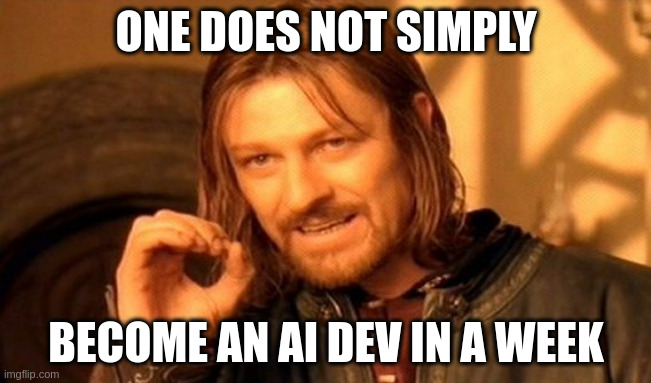

# Building a Multi-Modal Chat Application

1. Create a sample project using the Vercel AI SDK

   ```bash
   npx create-next-app@latest multi-modal-chatbot
   ```

   - Pick all the default options

2. Navigate to the project directory

   ```bash
    cd multi-modal-chatbot
   ```

3. Install the dependencies

   ```bash
   npm install ai @ai-sdk/react @ai-sdk/openai
   ```

4. Configure OpenAI API key to a local environment variable

   - Create a `.env.local` file in the root of the project

   - Add the OpenAI API key variable in the file by inserting this: `OPENAI_API_KEY=xxxxxxxxx`

   - Replace `xxxxxxxxx` with your OpenAI API key

5. Create a Route Handler at `app/api/chat/route.ts`:

   ```tsx
   import { openai } from '@ai-sdk/openai';
   import { streamText, Message } from 'ai';
   
   // Allow streaming responses up to 30 seconds
   export const maxDuration = 30;
   
   export async function POST(req: Request) {
     const { messages }: { messages: Message[] } = await req.json();
   
     const result = streamText({
       model: openai('gpt-4o'),
       messages,
     });
   
     return result.toDataStreamResponse();
   }
   ```

   - Use a model with multimodal vision capabilities, like [gpt-4o](https://platform.openai.com/docs/models/gpt-4o)

6. Open the `app/page.tsx` file

7. Add the chat component to the page:

   ```tsx
   "use client";

   import { useChat } from "ai/react";

   export default function Chat() {
     const { messages, input, handleInputChange, handleSubmit } = useChat();
     return (
       <div className="flex flex-col w-full max-w-md py-24 mx-auto stretch">
         {messages.map((m) => (
           <div key={m.id} className="whitespace-pre-wrap">
             {m.role === "user" ? "User: " : "AI: "}
             {m.content}
           </div>
         ))}

         <form
           onSubmit={handleSubmit}
           className="fixed bottom-0 w-full max-w-md mb-8 border border-gray-300 rounded shadow-xl"
         >
           <input
             className="w-full p-2"
             value={input}
             placeholder="Say something..."
             onChange={handleInputChange}
           />
         </form>
       </div>
     );
   }
   ```

8. Import and implement a `useState` and a `useRef` hook:

   ```tsx
   import { useState, useRef } from "react";

   export default function Chat() {
      const { messages, input, handleInputChange, handleSubmit } = useChat();

      const [files, setFiles] = useState<FileList | undefined>(undefined);
      const fileInputRef = useRef<HTMLInputElement>(null);

      ...
   ```

9. Add a `div` inside the message content to upload files:

   ```tsx
   <div>
     {m?.experimental_attachments
       ?.filter((attachment) => attachment?.contentType?.startsWith("image/"))
       .map((attachment, index) => (
         
       ))}
   </div>
   ```

10. Modify the `form` element to handle the file upload:

    ```tsx
    <form
      className="fixed bottom-0 w-full max-w-md p-2 mb-8 border border-gray-300 rounded shadow-xl space-y-2"
      onSubmit={(event) => {
        handleSubmit(event, {
          experimental_attachments: files,
        });

        setFiles(undefined);

        if (fileInputRef.current) {
          fileInputRef.current.value = "";
        }
      }}
    >
      <input
        type="file"
        className=""
        onChange={(event) => {
          if (event.target.files) {
            setFiles(event.target.files);
          }
        }}
        multiple
        ref={fileInputRef}
      />
      <input
        className="w-full p-2 text-black"
        value={input}
        placeholder="Say something..."
        onChange={handleInputChange}
      />
    </form>
    ```

11. Run the project

    ```bash
    npm run dev
    ```

12. Open the browser and navigate to <http://localhost:3000>

13. Use an image as a prompt to generate a text response

    - Upload an image to the chat
    - Ask a prompt related to the image

14. Hit **Enter** to send the message

15. Experiment with the chat application

    - For example, you can use one of the images provided in the `images` folder for this lesson

    [](../images/image4.png)

    > AI: This image is a variation of the "One Does Not Simply" meme. It features a scene from the movie "The Lord of the Rings: The Fellowship of the Ring," where the character Boromir, played by Sean Bean, says the line "One does not simply walk into Mordor." In this particular variation, the text has been altered to read "One does not simply become an AI dev in a week," humorously highlighting the difficulty and complexity of becoming an artificial intelligence developer in a short period of time. The meme format is often used to emphasize the challenges or impossibilities of various tasks by replacing "walk into Mordor" with other difficult or unrealistic actions.
    >
    > > User: But now with all these AI coding tools it is becoming super easy to be a developer, right?
    > > AI: While AI coding tools and advancements in technology have certainly made some aspects of software development easier and more accessible, becoming a proficient developer still requires a significant amount of learning, practice, and understanding of fundamental concepts. Here are a few points to consider:
    > >
    > > 1. **Learning Curve**: Even with AI tools, understanding programming languages, algorithms, data structures, and software design principles is essential. These foundational skills are crucial for writing efficient and effective code.
    > >
    > > 2. **Problem-Solving Skills**: Development is not just about writing code; it's about solving problems. This requires critical thinking, creativity, and the ability to break down complex problems into manageable parts.
    > >
    > > 3. **Debugging and Maintenance**: AI tools can assist in writing code, but debugging and maintaining code are still challenging tasks that require a deep understanding of the codebase and the ability to troubleshoot issues.
    > >
    > > 4. **Domain Knowledge**: Different areas of development (e.g., web development, mobile development, AI, data science) require specific domain knowledge. AI tools can help, but developers still need to understand the context and requirements of their specific field.
    > >
    > > 5. **Continuous Learning**: Technology is constantly evolving, and developers need to keep up with new tools, frameworks, and best practices. This requires a commitment to continuous learning and professional development.
    > >
    > > 6. **Collaboration and Communication**: Development often involves working in teams, requiring good communication and collaboration skills. Understanding how to work effectively with others is a key part of being a successful developer.
    > >
    > > In summary, while AI tools can significantly aid the development process and reduce some of the barriers to entry, becoming a skilled developer still requires a solid foundation in computer science principles, problem-solving abilities, and a commitment to continuous learning.
