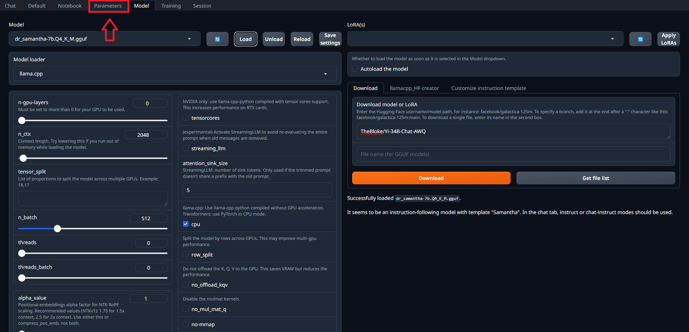

# Using Text Generation WebUI to Chat with an Assistant

1. Open the `Parameters` tab

   - Make sure that you have a model loaded before proceeding
   - 

2. Configure the model inference parameters

   - Set the `max_new_tokens` to `512` to limit the length of the generated text

   - Set the `temperature` to `0.7` to control the randomness of the generated text

   - Set the `top_k` to `50` to control the diversity of the generated text

   - Set the `top_p` to `0.9` to control the diversity of the generated text

   - Save the parameters in a `preset` for future use
   - 

3. Open the `Chat` tab

4. Type a message in the chat interface and hit `Generate`

5. If you don't like the response generated, you can click in the Hamburger button before the text input and select `Regenerate`

6. If you want the assistant to continue generating messages without a new prompt, you can click `Continue`
