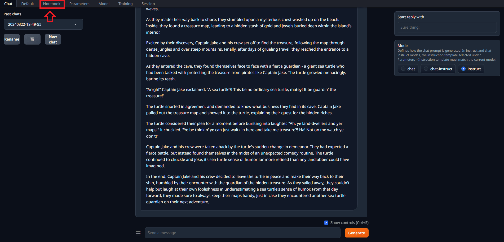

# Using Text Generation WebUI Notebook

1. Load a model fine-tuned for instruction-following tasks

2. Select `Notebook` tab

   - 

3. Type the instructions in the `Textbox`

   - The prompt should follow the format expected by the model's fine-tuning to follow instructions

4. When you click `Generate`, the model will process the entire `Textbox` content and append the response to it

5. At any time you can edit the `Textbox` content, even past messages and the generated responses before generating a new inference

   - Different from the `Chat` interface, the `Notebook` interface gives you entire control over the conversation, without the need to _"impersonate"_ the assistant nor editing message by message

6. You can Stop the generation process at any time by clicking the `Stop` button, change the content, and click `Generate` again to resume the process

7. You can also use the `Undo` and `Regenerate` buttons to alter only the last changes made in the last inference

8. You can copy any chat history from the `Chat` tab to the `Notebook` by clicking in `Send to Notebook` button in the Hamburger Button

9. Pick our previous chat with the Spanish `Chat-instruct` example and send it to the notebook

10. Append the following lines in the `Textbox`:

    ```text
    ### Instruction:
    Translate this to Italian language

    ### Response:
    ```

11. Click `Generate` and see the model responding inside the textbox itself

    - The final state should look like this:

    ```text
    Below is an instruction that describes a task. Write a response that appropriately completes the request.

    ### Instruction:
    Continue the chat dialogue below. Write a single reply for the character "AI Character".  Always answer in Spanish. Answer in Spanish even when the question is in english.

    The following is a conversation with an AI Large Language     Model. The AI has been trained to answer questions, provide recommendations, and help with decision making. The AI follows user requests. The AI thinks outside the box.

    AI Character: How can I help you today?
    Assistant: How to make a Pepperoni pizza?


    ### Response:
    AI Character: Para hacer una pizza de pepperoni,     necesitarás masa para pizza, queso fundido, tomates enlatados, cebollino finamente picado y sal al gusto.
    1. Empieza calentando el horno a temperatura alta.
    2. Extiende la masa para pizza en un tablero de cortar.
    3. Rocíale la base con queso fundido derretido.
    4. Coloca los tomates enlatados en capas sobre la mezcla de queso.
    5. Agrega el cebollino finamente picado encima de los     tomates.
    6. Dispón las lonchas de pepperoni por encima del cebollino.
    7. Esparce sal al gusto.
    8. Enrolla la pizza hacia arriba.
    9. Hornea la pizza durante unos 10-12 minutos o hasta que     esté dorada y crujiente.


    ### Instruction:
    Translate this to Italian language

    ### Response:
    Per fare una pizza di pepperoni, avrete bisogno di pasta     da pizza, formaggio fuso, pomodori concassati, prezzemolo tritato e sale al gusto.

    1. Accendi il forno a temperature alte.
    2. Stendevi la sfoglia per pizza su uno stampo da taglio.
    3. Ungetevi il fondo della tortilla con del formaggio fuso.
    4. Distribuisci i pomodori concassati in strati sulla     mistura di formaggio.
    5. Spaziando bene, distribuisci il prezzemolo tritato sul     pomodoro.
    6. Disporrai le fette di peperoni sull'insalata di     prezzemolo.
    8. Raggirizzandoti di sale al gusto.
    8. Ricoprirai la pizza con l'altra metà dello stampo da     taglio.
    9. Infornate la vostra pizza per circa 15-20 minuti o fino a quando non si sarà ben dorata e croccante.
    ```
