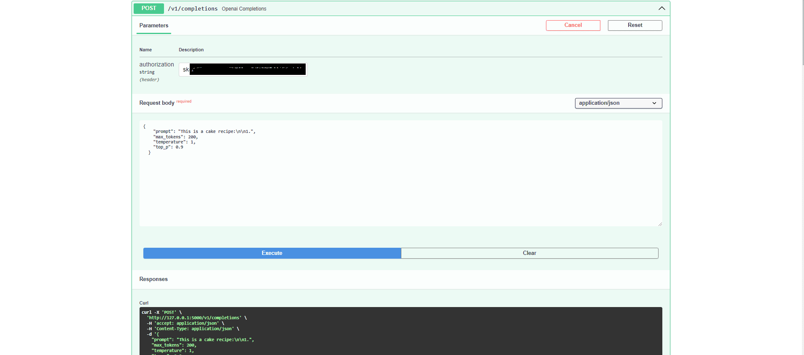

# Text Generation WebUI API

1. To enable the API, you need to start the Text Generation WebUI with the `--api` flag

   - Alternatively, you can use the `Session` tab to mark the `api` checkbox in the `Boolean command-line flags` pane

   - The `openai` checkbox must be checked in the `Available extensions` pane for the API to work correctly

   - After selecting click in `Apply flags/extensions and restart`

2. The API will be available at <http://127.0.0.1:5000>

   - If you're using the [Google Colab](https://colab.research.google.com/github/oobabooga/text-generation-webui/blob/main/Colab-TextGen-GPU.ipynb) notebook, you should check the `api` flag to enable the public API link to be called from over the web

     - The API link for your instance will be displayed in the notebook output after `INFO OpenAI-compatible API URL:`

3. Check the interactive API Documentation at <http://127.0.0.1:5000/docs>

4. The Text Generation WebUI must have a model loaded for the API to be able to handle tasks

5. Check if your API is working correctly by running a test command on the `completions` endpoint

   ```bash
   curl http://127.0.0.1:5000/v1/completions \
     -H "Content-Type: application/json" \
     -d '{
       "prompt": "This is a cake recipe:\n\n1.",
       "max_tokens": 200,
       "temperature": 1,
       "top_p": 0.9
     }'
   ```

   For Windows users, use this command instead:

   ```cmd
   curl http://127.0.0.1:5000/v1/completions -H "Content-Type: application/json" -d "{\"prompt\": \"This is a cake recipe:\\n\\n1.\", \"max_tokens\": 200, \"temperature\": 1, \"top_p\": 0.9}"
   ```

   - Alternatively, you can test it within the documentation at <http://127.0.0.1:5000/docs>:

   - 

6. You can now adapt your scripts to consume this local API instead of the OpenAI APIs

   - Example of a Python script to consume the local API

     ```python
     import requests
     import json

     url = "http://127.0.0.1:5000/v1/completions"

     headers = {
         "Content-Type": "application/json"
     }

     while True:
         user_message = input("> ")
         body = {
             "prompt": user_message
         }
         response = requests.post(url, headers=headers, json=body, verify=False)
         message_response = json.loads(response.content.decode("utf-8"))
         assistant_message = message_response['choices'][0]['text']
         print(user_message + assistant_message)
         print("\n")
     ```
