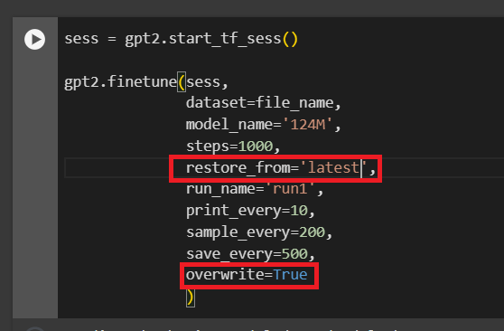

# Training GPT-2 Small

1. Create an account at [Google Colab](https://colab.research.google.com)
   - Unless you have access to a good cluster of GPUs, training even the most basic GPT-2 model can be very time consuming and expensive
   - Google Colab offers free access to GPUs and TPUs, which can be used to train GPT-2 models
2. Access the [Collaborative notebook](https://colab.research.google.com/drive/1VLG8e7YSEwypxU-noRNhsv5dW4NfTGce)
   - Open the notebook in `Google Chrome` to avoid compatibility issues
3. Log in with your account
   - Use a personal google account or a company account where you are able to manage sharing permissions
   - You may use a free Colab account to run this notebook
     - Depending on your usage, you might need to upgrade to `Colab Pro` or even `Colab Pro+`
     - Alternatively, you can set up a credit card to purchase compute units in the `Pay As You Go` plan
4. Copy the notebook to your Google Drive to keep it and save your changes
   - Click on `File` -> `Save a copy in Drive`
5. upload the `shakespeare.txt` file in the `examples` folder to the `sample_data` folder of the notebook
   - Click on the folder icon on the left side of the notebook
   - Click on the `sample_data` folder
   - Click on the three dots in the `sample_data` folder and select the `Upload` option, then select the `shakespeare.txt` file to upload it to the folder
     - If your file is uploaded to the root folder, you can move it to the `sample_data` folder by dragging and dropping it
   - Alternatively, you can use the `copy_file_from_gdrive` to copy a file from your personal Google Drive
6. Follow the steps in the notebook to train a GPT-2 model with the sample data provided
   - Pick the smallest model available (`124M`) for this exercise
   - Use the sample data (`"sample_data/shakespeare.txt"`) to train the model
     - Set `file_name = "sample_data/shakespeare.txt"`
   - Run with the following parameters:

   ```python
   gpt2.finetune(sess,
              dataset=file_name,
              model_name='124M',
              steps=100,
              restore_from='fresh',
              run_name='run1',
              print_every=10,
              sample_every=20,
              save_every=50
              )
   ```

7. Fine-tune the model until it reaches a `loss` under `2.0`
   - Modify the parameter `restore_from` to `'latest'` and add `overwrite=True` if you want to continue finetuning an existing model without creating duplicate copies
     

8. Generate some text from the new pre-trained model

   - Use the following code to generate text:

   ```python
   gpt2.generate(sess,
              length=20,
              temperature=0.5,
              prefix="To be or not to",
              nsamples=5,
              batch_size=5
              )
   ```

   - You can test different `prefix` values to measure how well the model has learned the text used in the finetuning process
   - Restart the session and run the same generation in the base model to compare the results
